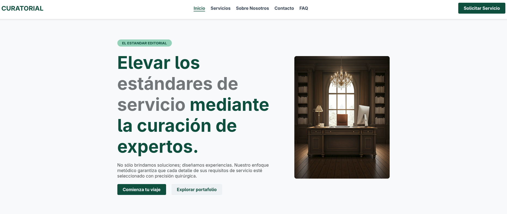

# 🌲 CURATORIAL - Sitio Web



## 📌 Descripción

Este proyecto consiste en el desarrollo de un sitio web para una empresa ficticia orientada a una prestación de servicios de arquitectura y diseño de interiores.

El objetivo es aplicar conocimientos de HTML semántico, CSS y trabajo colaborativo con Git.

---

## 👥 Integrantes - Grupo N7

* Iñaki Carcereny
* Valentin De Pascale
* Joaquin Marcilese
* Valentin Rodriguez
* Ezequiel Barrionuevo
* Alan Axel Hansen

---

## 🗂️ Estructura del Proyecto

```
/proyecto
 ├── /assets
      ├── /favicon
           ├── favicon.png
      ├── /images
           ├── image.png
           ├── home.png
           ├── home-2.png
           ├── home-3.png  
 ├── /pages
      ├── contacto.html
      ├── equipo.html
      ├── faq.html
      ├── pedido.html
      ├── servicios.html
 ├── /styles
      ├── contacto.css
      ├── equipo.css
      ├── faq.css
      ├── home.css
      ├── pedido.css
      ├── servicios.css
      ├── styles.css
index.html
README.md
```

---

## 🛠️ Tecnologías utilizadas

* HTML5
* CSS3
* Git & GitHub

---

## 🚀 Funcionalidades

* Navegación entre páginas
* Visualización de servicios
* Formulario de pedido
* Formulario de contacto
* Sección de preguntas frecuentes

---

## 🎨 Decisiones de diseño
* Se utilizó la página Google Stitch para el diseño, donde partimos de uno general y se fue iterando hasta encontrar el diseño deseado.

* Se utilizaron etiquetas semánticas como `header`, `nav`, `main`, `section`, `article` y `footer`.
* Se organizó el CSS de forma modular donde tenemos estilos globales en styles.css y luego cada ruta tiene su propio archivo.
* Se aplicó el modelo de caja (margin, padding, border).
* Se utilizaron clases para reutilización de estilos.

---

## ▶️ Ejecución

Abrir el archivo `index.html` en cualquier navegador web.

---

## 🌿 Metodología de trabajo

* Cada integrante del grupo se encargo de una ruta.
* Uso de ramas: `main`, `dev` y ramas individuales.
* Creación de Pull Requests para integración.
* Merge final en rama `main` para la entrega.
